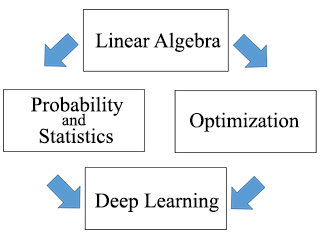

~~大二暑假是弯道超车的好时候~~

我不是一个太能闲的住的人，所以总想着给自己找点事情做。所以就会想着，为什么不学一点自己喜欢的东西的呢？这些东西可能对我以后的学习和生活没有太多帮助，或者说不需要如此系统性的学习，但是学这些东西这件事本身就给我带来了很多乐趣，于我而言，那就足够了。

去年学了很多C++相关的知识，今年本想强化一下的，奈何没有找到合适的课程。今年的重点是数据与机器学习，其实很多是我在平时学习时随手点开的课程，觉得很有趣，但是没有在课余时间学完，最后都囤到了暑假。

自学是磨人的，你没有ddl和GPA的压力，所以学的会很随性，学的会很浮躁。所以我在学完一遍后都会再过一遍，找一些补充资料。

我坚信三分钟热度有三分钟收获。哪怕你只是知道这件事是什么，也是足够的。你所要做的，只是找到合适自己的自学办法，然后认真学习并坚持下去。

感谢csdiy，让我知道有这么多有趣的课程。感谢设计这些课程并将其开源的老师、学校以及各种学习者，让我有机会接触世界上各种精彩的课程。我不批判本科所学的课程，在其中我还是学到很多东西，但我知道与这些课程相比，我们仍有一段路要走。

愿我们在学习路上有所收获，所念皆得。

## UCS CS70 discrete Math and probability theory
课程网址：[CS70](http://www.eecs70.org/)

伯克利的离散数学入门课程。内容包括逻辑证明，基础数论，图论，多项式，概率论和随机过程（主要是马克洛夫链）。课程内容丰富且生动形象，对于一门入门课而言深度和广度都是足够的。

> 具体的理论与算法的对应关系列举如下：
> 
> - 逻辑证明：稳定匹配算法
> - 图论：网络拓扑设计
> - 基础数论：RSA 算法
> - 多项式环：纠错码设计
> - 概率论：哈希表设计、负载均衡等等
> 
> (源自csdiy的介绍)

课程的Notes写的非常棒，第一次感受到读数学相关的资料是一件很快乐的事情，比大多教科书写的好多了，感觉自学把notes看懂就行，里面的公式建议自己推导一下（尤其是数论和图论那一部分）。

每周有对应的Homework和Discussion，隔一两周会公布答案，作业偏难但是一定要好好做作业！

## MIT 18.S191 Computational Thinking
课程网址：[Computational Thinking](https://computationalthinking.mit.edu/)

一门由Alan Edelman, David P. Sanders 和 Charles E. Leiserson三位教授开设的计算思维入门课，内容涵盖了图像处理、社会科学与数据科学、气候学建模三个主题。在这三个主题的带领下来指引学生理解算法、数据解算法、数学建模、数据分析、交互设计、图例展示，让学生体验计算与科学的美妙结合，很适合作为一门数值分析或者数据分析处理的入门课。

~~可以看到Alan教授家超级可爱的狗~~

Lectures的Notes非常棒，是由Julia的一个Pluto库生成的交互式文本（类似于Jupyter Notebook），看起来赏心悦目，内容也是丰富有趣，Alan教授希望我们能够"play fun with it"。课程作业也是在Pluto里完成的，基本上是按照课内所学知识完成的，不难，更多像是一种实践而不是直接搓代码，但是用的是Julia，所以写起来会有些生疏。

lectures的videos也附在课程网址里，前两个topics的视频可以在B站上找到，后一个topic的视频可能要到油管上看，videos一般是教授讲解并操作notes，我后面基本上只看notes没有看videos了.

课程使用的语言是[Julia](https://julialang.org/)，是由MIT研发的一款科学计算编程软件，按照MIT的说法是希望到达Python一样好写，C语言一样快的效果。个人感觉语法和MATLAB类似，运行速度虽然快但是需要长时间的预编译。

## MIT 18.065 Matrix Methods in Data Analysis, Signal Processing, and Machine Learning

课程网址：[Matrix Methods in Data Analysis, Signal Processing, and Machine Learning](https://ocw.mit.edu/courses/18-065-matrix-methods-in-data-analysis-signal-processing-and-machine-learning-spring-2018/)

由Gilbert Strang教授主讲的线性代数的内容，算是18.06的拓展，偏在机器学习方面的应用。课程内容从线性代数出发，涵盖概率论和统计学、优化方法和深度学习，内容很丰富，里面的大多是方法都是针对高维数据的，内容包括低秩近似Eckart-Young theorem，随机矩阵乘法，梯度下降法等等。和18.06一样，教授讲述的时候主要用板书，会举例子辅助讲解。但是内容太多，很多东西都是以介绍为主，需要课后查一下资料补充相关知识。

有一本教材，内容会比课程上多，但是知识点更加细致。但是和这门课一样，很多内容只是以介绍为主没有太多拓展。所以个人认为不一定需要。

B站上有机翻视频，但普遍认为质量较低。OCW有给出官方英文字幕，加上老爷子讲话慢条斯理所以建议直接看英文原版字母。~~但是我很多没听懂~~

如果有志于机器学习或者想在线性代数的应用有更多了解的话可以尝试听这门课。

感谢Gilbert Strang拯救我的线性代数于水深火热之中。在此祝Gilbert Strang退休快乐，顺心顺意。

## UCB Data100

课程网址：[Data100](https://ds100.org/)

有一个前置课程 [UC Berkeley Data 8](https://www.data8.org/)，我没听但是不影响学这些知识。

UCB数据科学课程，内容包括数据处理、数据可视化、特征处理、传统机器学习方法等。内容涵盖Pandas, Numpy, Matplotlib，Seaborn等数据科学常用工具包，python中sql指令，sklearn机器学习包。如果你对数据科学感兴趣的话，真心推荐这门课程！

课程有video但都是讲解PPT的内容，PPT做的很好，我是直接看PPT自学。

这门课是用python语言，代码都是在Jupyter Notebook上实现的，课堂上的codes和slide都是开源的，不过有些课是请别的学校的老师讲课所以看不了他的slides。课后的lab和homework需要UCB的学生账号，github上有人备份了[作业代码](https://github.com/DS-100)。为了实现作业里的自助评分需要安装一个otter包和在测试文件的代码前面加上`OK_FORMAT = True`

刚开始写Pandas的作业的时候因为不太熟悉所写起来有点痛苦，以及sql没怎么学所以sql的lab也很痛苦，其他作业就还好。

lab和homework质量非常高！

## 一些碎碎念

写完这些东西意味着我的暑假结束了。

在暑假开始前，我和一位朋友聊天，她祝福我有一个快乐的假期。于是在写完这些东西后，我不禁会想，这个暑假我过的快乐嘛？

七月中上旬，我忙于小学期与搬宿舍。而后回了家，过上了一段很悠闲的时光。八月上旬，酷暑未消，我却早早回了学校，大部分时间奔波在玉泉和西溪两地。

这或许是很充实的假期，或许休息的时间很短，或许很多时间被浪费在一些无意义的事情上。但是，对于前面的问题，至少我可以昂首挺胸的说，我过的很快乐。

可是，当我今天晚上从实验室回来，仍想着自己还没成功搭建起的仪器，做到一半总是失败的测试，望着天目山路上的车水马龙，一种疲惫和无力感又一次从心底里浮起。

我想起了《酒保行动》里，Jill因自己麻木的大学生活而对往后的生活产生了恐慌，或许那是同一份感受，我极度害怕自己碌碌无为半生却不自知，而后在某天从一场无谓的梦中醒来后恍然大悟，却再也没有能力与精力去改变，于是被迫接受这样的结局。我曾无数次想到这些事情，惴惴不安，决意奋起，可也并不知晓是否有所改变。

但人生如意的事情又哪有那么多呢？

只是看着这些学过的东西，却有些恍惚，又有几分生活的实感。或许只是因为，没有负担地学一些有趣的东西真的很开心。
