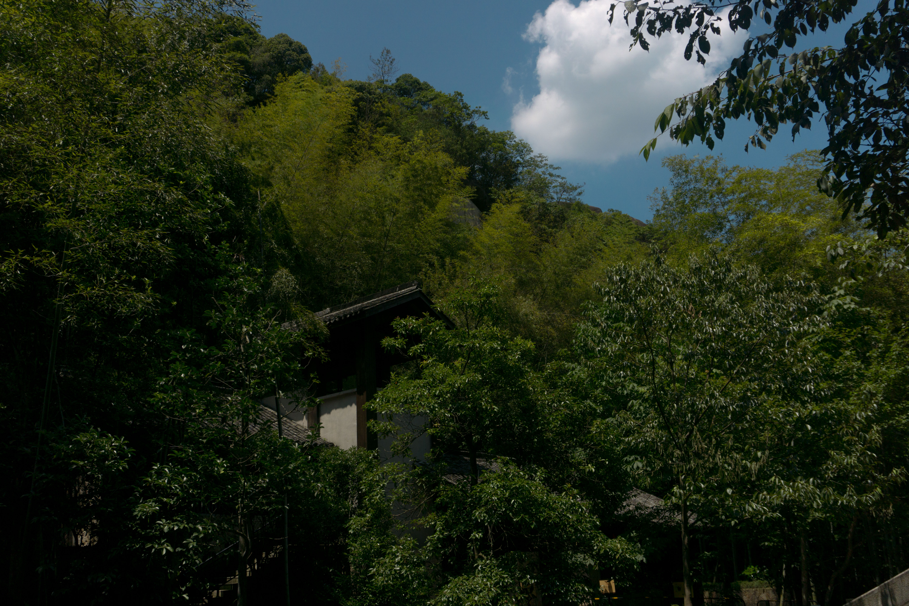

跑去台州玩了两天，第一天去天台山，第二天去临海。

天台山风景还是很漂亮的，尽管是夏天，但是山上不会很热。挺喜欢的

## 国清寺

从火车站下来直接打车到国清景区，路程大约十几分钟。

国清寺还挺漂亮，人不是很多，是一个没有太商业化的寺庙，和大多是江南寺庙还是蛮相似的。但是还是有很多很漂亮的地方！如果去天台山的话还是很建议去这个地方的！

## 石梁飞瀑

下午去了石梁飞瀑。从游客中心可以买到车票，要坐四十分钟左右的车程。上山的路比较绕，所以会晕车的人要注意一下。大巴车会给你送到山上的入库，返程的车要到山下的入口坐，按照景区路线走就可以啦。

石梁飞瀑主要有三个瀑布，整体还是挺漂亮的，景区不大，走走拍拍大约一小时，虽然在山上，但是爬山的部分不多。很适合看看风景，拍拍照。坐大巴的时候有人问司机大概玩多久，司机说最多两个小时。

## 杂项

从石梁飞瀑出来后打车去了劳动路逛一逛（吃东西），天台县并不是很发达，县城整体还是小县城的感觉，没有太多了高楼大厦，但是也热闹，还算是有丰富的生活气息。

